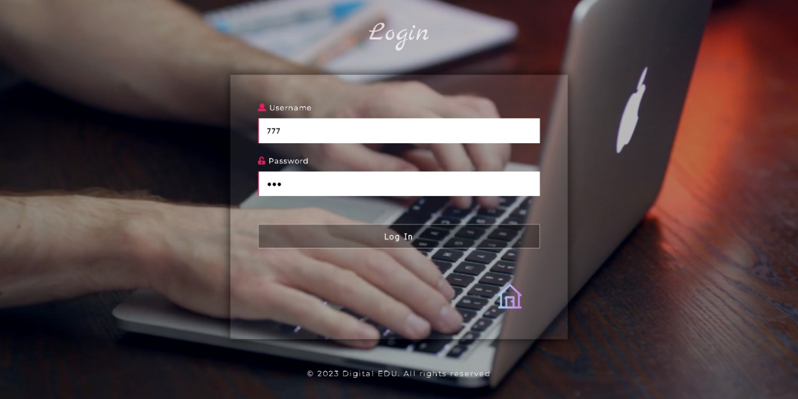
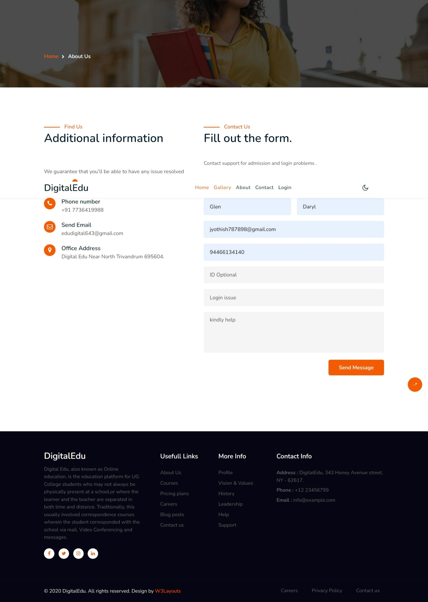
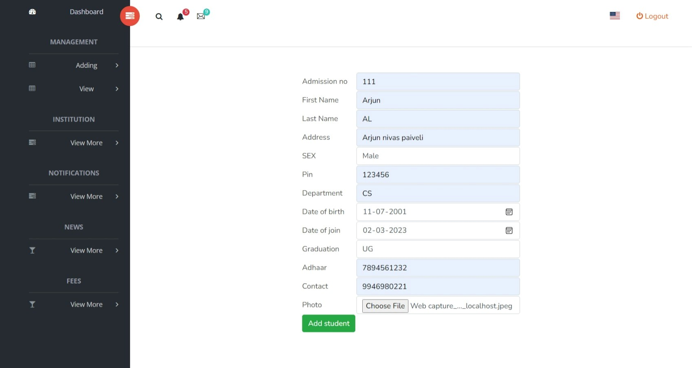
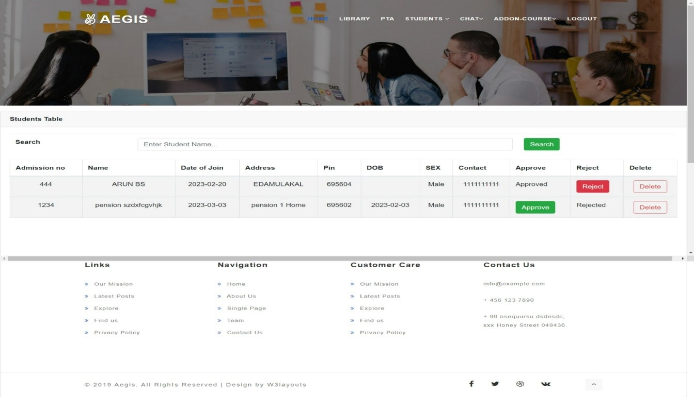
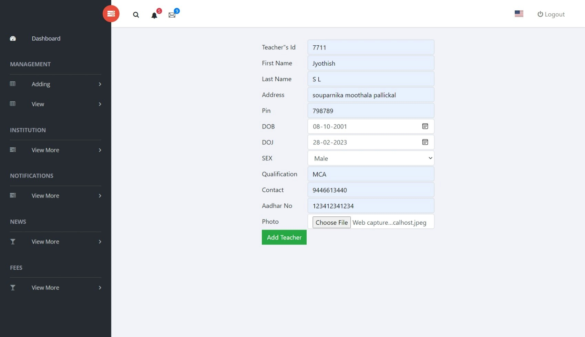
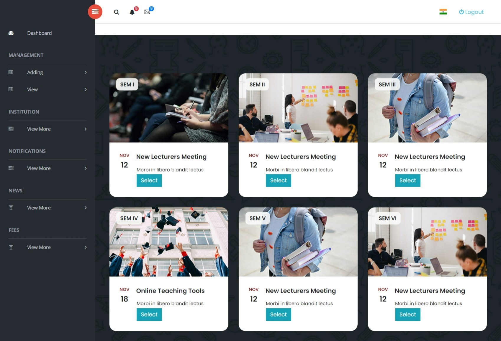

# Online_Education(Digital Edu)

Digital Edu, also known as Online education, is the education platform for UG College students who may not always be physically present at a
  school,or where the learner and the teacher are separated in both time and distance. Traditionally, this usually involved correspondence courses
  wherein the student corresponded with the school via mail, Video Conferencing and messages .Digital education is a technology mediated modality 
  and has evolved with the evolution of technologies such as video conferencing, and internet . Today, it usually involves online education and the 
  learning is usually mediated by some form of technology.

